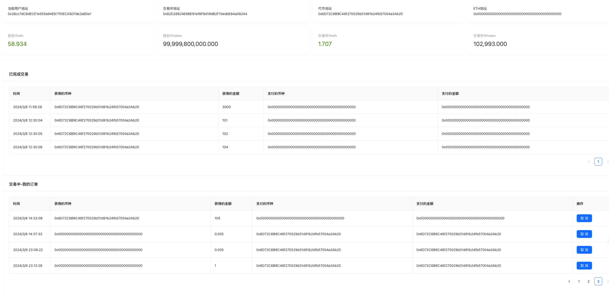
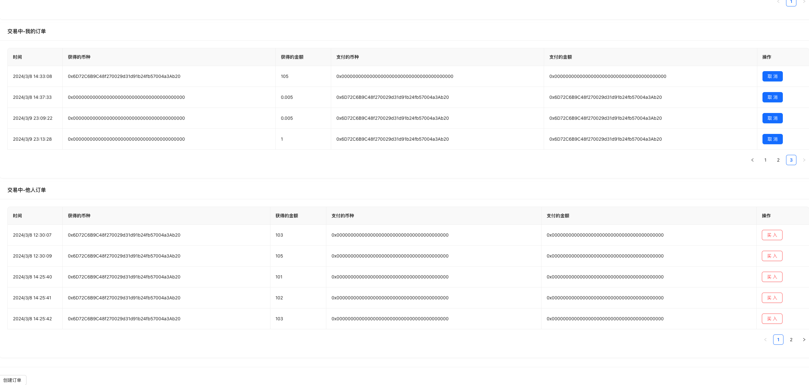
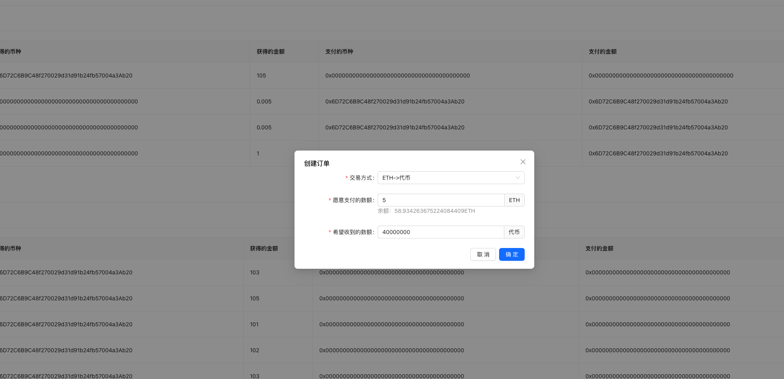
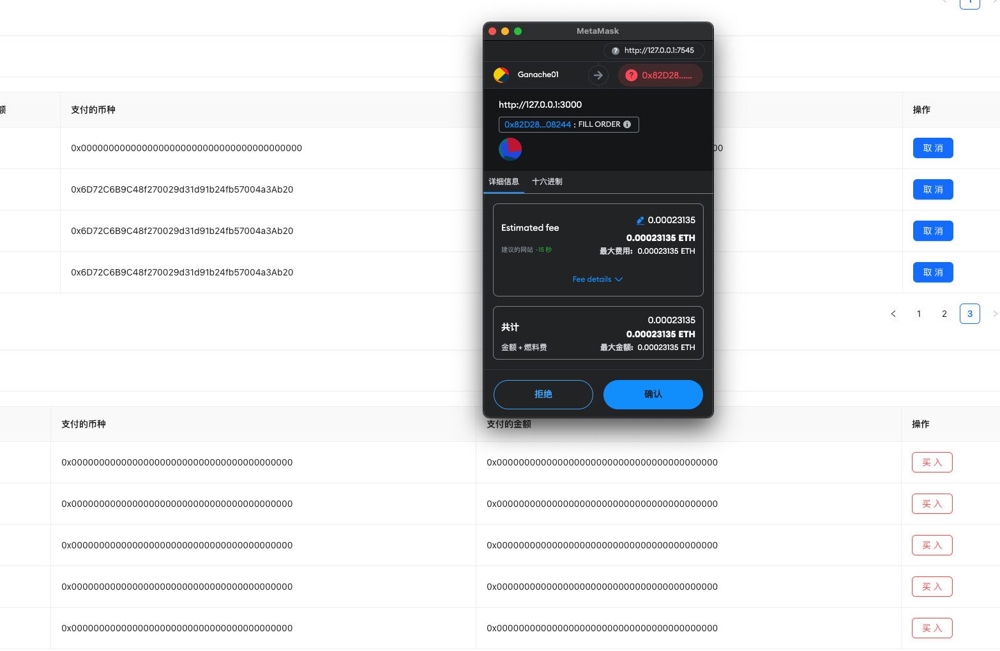

# 前端技术栈

Turbo

React

Next

Vue3

...

每个项目技术栈都有所不同

数据库：Postgressql

# 协议开发技术栈

基于Truffle、Remix、Hardhat开发、部署和测试Solidity合约

个人更偏向于使用Truffle和Remix

基于[OpenZeppelin-openzeppelin-solidity](https://github.com/pkdcryptos/OpenZeppelin-openzeppelin-solidity/tree/master)的ERC20、ERC721标准及工具方法的智能合约开发

# 前端与Web3交互的工具库

Web3.js

ether.js

Wagmi：提供 React Hooks 风格 API 的智能合约交互库

RainbowKit：用于构建 Web3 钱包连接界面的库，支持 React。

# 区块链相关开发工具

Ganache：本地部署ETH链测试环境，方便本地开发和测试

Infura：区块链连接节点

PINATA：IPFS文件服务

ALCHEMY：区块链连接节点

MetaMask：钱包账户管理

# Web3项目简介
### SimpleVoteSystem

去中心化投票APP

### NFT-Marketplace-Tutorial 

简易NFT交易市场

### SimpleExchange

简易去中心化交易所

### SimpleWallet

简易钱包项目

使用 ethers.js 连接 Metamask，实现了连接、断开、查询余额、刷新余额、转账等加密钱包的极简功能。

- `@repo/eslint-config`: `eslint` configurations (includes `eslint-config-next` and `eslint-config-prettier`)
- `@repo/typescript-config`: `tsconfig.json`s used throughout the monorepo

### Web3Examples

